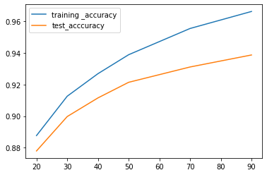
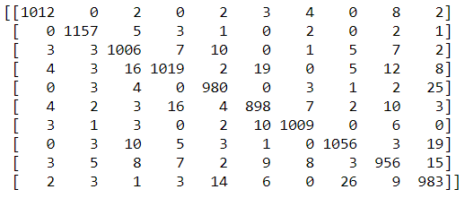

# Digit_Recognizer_using_tree_classifiers

Dataset - https://www.kaggle.com/c/digit-recognizer

The accuracy of gradient boosting classifier increases with increase in number of estimators upto a certain.

Confusion Matrix by the most accurate Gradient Boosting Classifier.

Best Accuracy attained by the model:
Training accuracy - 0.9989206349206349
Testing accuracy - 0.9596190476190476
